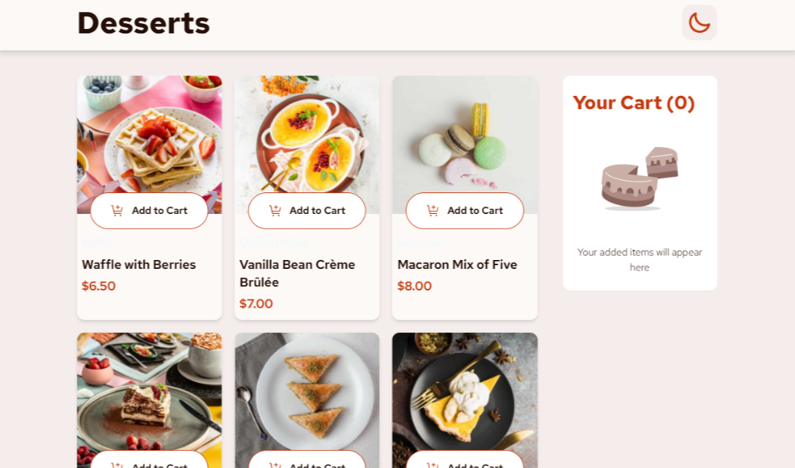
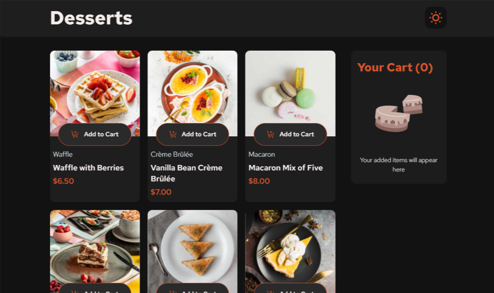

# 🛒 Lista de Produtos com Carrinho

---

## 📝 Descrição

Este projeto é uma solução para o desafio do [Frontend Mentor](https://www.frontendmentor.io/home), onde a proposta é criar uma é **carrinho de compras online**. Para melhorar a experiência do usuário, adicionei um diferencial no layout para versões tablet e mobile.
Originalmente, em telas menores, o carrinho ficaria fixo na parte inferior, obrigando o usuário a rolar a página para acompanhar seu conteúdo. No meu projeto, implementei um botão no header que abre o carrinho como um modal, tornando a navegação mais prática e o layout mais agradável de usar.

--- 

## ⚙️ Funcionalidades
- Adicionar e remover itens do carrinho
- Remover todos os itens de uma vez
- Finalizar pedido e limpar o carrinho
- Alternar entre temas (claro/escuro)

---

## 🛠️ Tecnologias Utilizadas

- [React](https://react.dev/)
- [Tailwind CSS](https://tailwindcss.com/)
- [daisyUI](https://daisyui.com/)

---

## 💡 Conceitos Aplicadados

- **Context API** para compartilhamento de dados na aplicação
- **useReducer** para gerenciamento de estados complexos
- **Componentização** e boas práticas de organização de código

---

## 📸 Capturas

 

 

---

## 🌐 Acesse o Projeto Online

Você pode testar a aplicação diretamente no seu navegador clicando no link abaixo:

👉 [Lista de Produtos com Carrinho](https://product-list-with-cart-nh69.onrender.com/)

---